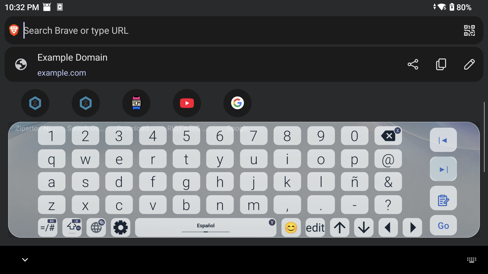
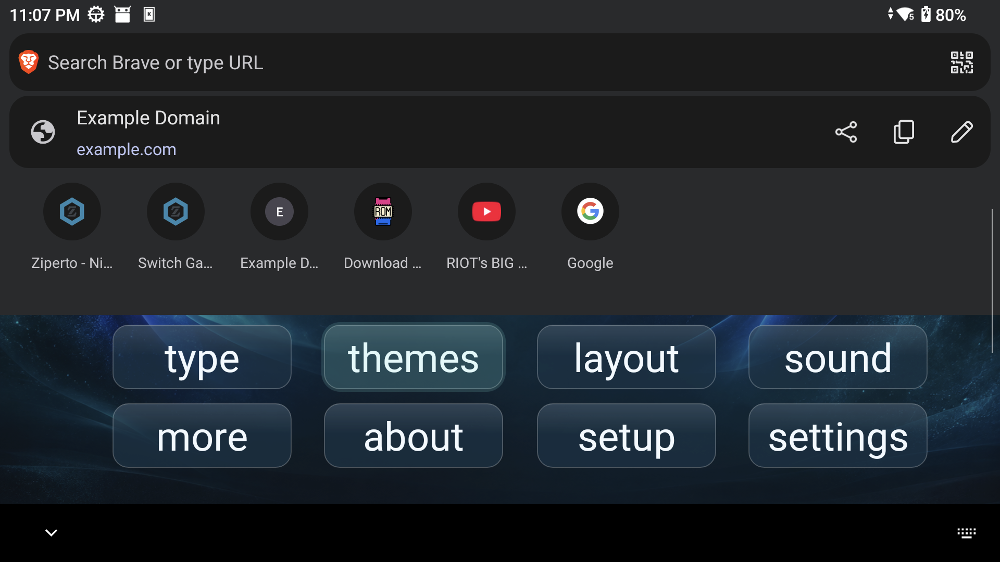
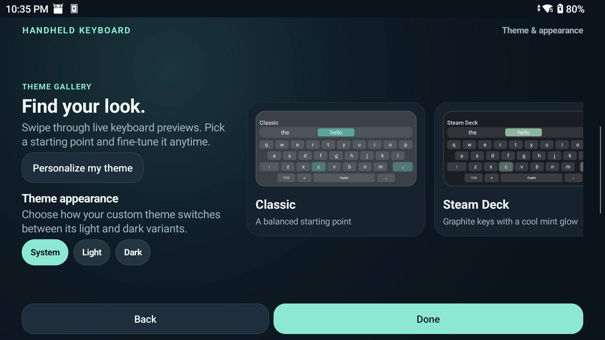

# Handheld Keyboard

A controller-friendly Android keyboard for handheld gaming devices, Android TV, and touchscreen use. This is a modified version of [LeanKeyboard](https://github.com/yuliskov/LeanKeyboard/tree/6.1.31).

**Modified on 2026-09-14.** This project adds handheld layouts and navigation, a redesigned onboarding flow, adjustable sizing, custom light/dark themes, keyboard surface effects, configurable sound feedback, emoji and textmoji pickers with whole-grapheme backspace, and a themed editor-action key integrated into the keyboard row. The handheld keyboard repurposes its unused on-screen microphone key for emoji access. The inherited source is distributed under GPL-3.0-only; see [LICENSE.md](LICENSE.md).

## In action

| Keyboard in landscape | Quick settings with controller navigation | Theme gallery |
| --- | --- | --- |
|  |  |  |

## Features

- Navigate and type with a D-pad or supported game controller, including corrected spatial key focus and controller-aware key hints/remapping.
- Show recognizable Xbox, PlayStation, Nintendo Switch, and generic controller icons beside mapped keyboard actions.
- Move the editor cursor with left/right controls while keeping cursor movement inside the focused editor.
- Adapt the keyboard to handheld screen sizes and landscape layouts; adjust its height or use a floating layout.
- Choose system, light, or dark appearance. Edit colors and background images for the custom theme variants.
- Select solid, translucent, or glass-style keyboard surfaces.
- Configure sounds for navigation, typing, deletion, and modifier changes.
- Insert emoji and textmoji from dedicated, controller-navigable keyboard pages.
- Preview themes in onboarding and open the reorganized keyboard settings directly from the keyboard.
- Match the Go, Send, Search, or Done action key to the keyboard theme; the action key sits alongside the cursor controls.
- Retain LeanKeyboard's language and layout support.

## Support the project

Donations help maintain and test Handheld Keyboard on real handheld devices.

## Download and install

Download the latest APK and its SHA-256 checksum from [GitHub Releases](https://github.com/luisho24/HandheldKeyboard/releases/latest). The v0.4.4 APK is built from the minified `handheldRelease` variant. To allow an in-place upgrade from v0.4.0, it is signed with the same Android debug certificate used by that release. **This is not a production signing key**; use this APK for testing/sideloading only. A production release requires a privately managed signing key and cannot replace this build without uninstalling it first.

Install it with Android Debug Bridge:

    adb install -r HandheldKeyboard-v0.4.4-release.apk
    adb shell ime enable com.handheldkeyboard.ime/com.liskovsoft.leankeyboard.ime.LeanbackImeService
    adb shell ime set com.handheldkeyboard.ime/com.liskovsoft.leankeyboard.ime.LeanbackImeService

You can also enable and select the keyboard in Android's Languages & input settings.

## Build from source

Requirements: JDK 17 and Android SDK Platform 35. The release APK distributed on GitHub is signed after the Gradle build with the maintainer's local Android debug key so it stays compatible with v0.4.0; the private key is not included in this repository.

    ./gradlew :leankeykeyboard:testHandheldDebugUnitTest
    ./gradlew :leankeykeyboard:assembleHandheldRelease

The unsigned Gradle output is written to `leankeykeyboard/build/outputs/apk/handheld/release/`. The signed release artifact and checksum are published with each GitHub release.

## AI-assisted development

Development of this project used AI coding assistance under human direction and review. That describes how the source was developed; the shipped app contains no AI model, AI SDK, AI API client, or AI service integration.

## Privacy

See [PRIVACY.md](PRIVACY.md) for what the keyboard handles on-device and the limits of Android's optional controller voice-assist path. The app does not send typed text, theme images, or settings to a developer-operated service.

## Attribution and third-party licenses

This project is based on [LeanKeyboard 6.1.31](https://github.com/yuliskov/LeanKeyboard/tree/6.1.31) by Yuriy Liskov and contributors. The fork keeps the upstream source notices and GPL-3.0-only license; it is independently maintained and is not an official LeanKeyboard release.

Some inherited source files are Apache-2.0 licensed, and the voice overlay dependency is MIT licensed. See [THIRD_PARTY_NOTICES.md](THIRD_PARTY_NOTICES.md) and the included license texts in LICENSES/.
